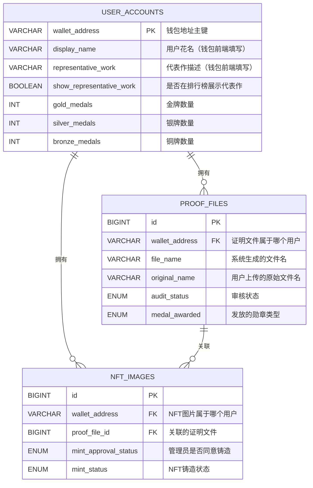

# 📱 BrokerWallet 正确的业务逻辑

## 🎯 代表作与证明文件的区别

### **代表作 (Representative Work)**
- 📝 **用户在钱包前端填写的文字描述**
- 💭 **纯文本内容**，例如："开发了多个DeFi协议，专注于智能合约安全"
- 🏠 **存储位置**：`user_accounts` 表的 `representative_work` 字段
- 👤 **用户控制**：用户可以选择是否在排行榜展示（`show_representative_work` 字段）

### **证明文件 (Proof Files)**
- 📄 **用户上传的实际文件**（PDF、图片等）
- 🗂️ **文件内容**：学位证书、工作证明、技能认证等
- 🏠 **存储位置**：文件系统 + `proof_files` 表记录文件信息
- 👨‍💼 **管理员审核**：决定发放金银铜勋章

## 🔄 完整业务流程

### 📱 钱包前端用户操作

#### 1️⃣ 填写个人信息（可选）
```
用户在钱包前端填写：
┌─────────────────────────────────────┐
│ 用户花名: [区块链开发者           ] │
│                                     │
│ 代表作描述:                         │
│ ┌─────────────────────────────────┐ │
│ │ 开发了多个DeFi协议，专注于智能  │ │
│ │ 合约安全，有5年区块链开发经验   │ │
│ └─────────────────────────────────┘ │
│                                     │
│ ☑️ 在排行榜上显示代表作              │
│                                     │
│ [保存信息]                          │
└─────────────────────────────────────┘

保存到数据库：
- display_name = "区块链开发者"
- representative_work = "开发了多个DeFi协议..."
- show_representative_work = TRUE
```

#### 2️⃣ 上传证明文件
```
用户在证明材料上传页面：
┌─────────────────────────────────────┐
│ 选择证明文件: [浏览文件...]          │
│                                     │
│ [上传]                              │
└─────────────────────────────────────┘

系统自动处理：
- 保存文件到文件系统
- 记录到 proof_files 表
- wallet_address 记录文件属于哪个用户
- audit_status = 'PENDING'
```

#### 3️⃣ 上传NFT图片
```
用户在NFT铸造页面：
┌─────────────────────────────────────┐
│ 选择已审核的证明文件:               │
│ ○ 学位证书.pdf (已获得金牌 🥇)      │
│ ○ 工作证明.jpg (已获得金牌 🥇)      │
│                                     │
│ 选择NFT图片: [浏览图片...]          │
│                                     │
│ [上传]                              │
└─────────────────────────────────────┘
```

### 🖥️ 管理员网页端操作

#### 4️⃣ 审核证明文件
```
管理员审核界面：
┌─────────────────────────────────────────────────────────┐
│ 待审核证明文件                                          │
│                                                         │
│ 用户: 0x1234...7890                                    │
│ 文件: 学位证书.pdf                                      │
│ 上传时间: 2024-01-15 10:30:00                          │
│                                                         │
│ [查看文件] [下载文件]                                   │
│                                                         │
│ 审核决定:                                              │
│ ○ 发放金牌 🥇  ○ 发放银牌 🥈  ○ 发放铜牌 🥉  ○ 拒绝 ❌    │
│                                                         │
│ [确认审核]                                             │
└─────────────────────────────────────────────────────────┘

审核通过后系统自动：
1. 更新 proof_files.audit_status = 'APPROVED'
2. 设置 proof_files.medal_awarded = 'GOLD'
3. 更新 user_accounts.gold_medals += 1
4. 发起区块链交易
5. 检查数据一致性
```

#### 5️⃣ 批准NFT铸造
```
管理员NFT批准界面：
┌─────────────────────────────────────────────────────────┐
│ 待批准NFT铸造                                           │
│                                                         │
│ 用户: 0x1234...7890                                    │
│ NFT图片: my_nft_image.jpg                              │
│ 关联证明: 学位证书.pdf (已获得金牌 🥇)                   │
│                                                         │
│ [查看图片] [查看证明文件]                                │
│                                                         │
│ 批准决定:                                              │
│ ○ 同意铸造 ✅  ○ 拒绝铸造 ❌                            │
│                                                         │
│ [确认批准]                                             │
└─────────────────────────────────────────────────────────┘
```

### 🏆 排行榜显示逻辑

```
排行榜展示：
┌─────────────────────────────────────────────────────────┐
│ 🏆 BrokerWallet 勋章排行榜                              │
│                                                         │
│ 第1名  区块链开发者                                     │
│       🥇 2  🥈 1  🥉 0                                  │
│       代表作: 开发了多个DeFi协议，专注于智能合约安全     │
│                                                         │
│ 第2名  NFT艺术家                                        │
│       🥇 1  🥈 2  🥉 1                                  │
│       代表作: 创作了100+个数字艺术作品                   │
│                                                         │
│ 第3名  全栈工程师                                       │
│       🥇 0  🥈 1  🥉 2                                  │
│       代表作: 不展示代表作                               │
│                                                         │
│ 第4名  匿名用户                                         │
│       🥇 0  🥈 0  🥉 1                                  │
│       代表作: 不展示代表作                               │
└─────────────────────────────────────────────────────────┘

排行榜查询逻辑：
SELECT 
    COALESCE(ua.display_name, '匿名用户') as display_name,
    ua.gold_medals, ua.silver_medals, ua.bronze_medals,
    CASE 
        WHEN ua.show_representative_work = TRUE AND ua.representative_work IS NOT NULL 
        THEN ua.representative_work 
        ELSE '不展示代表作' 
    END as representative_work
FROM user_accounts ua
WHERE ua.status = 'ACTIVE'
ORDER BY ua.gold_medals*3 + ua.silver_medals*2 + ua.bronze_medals DESC;
```

## 📊 数据库表关系（修正版）



## 🔑 核心设计要点

### 1️⃣ 代表作管理
```sql
-- 用户账户表中存储代表作信息
CREATE TABLE user_accounts (
    wallet_address VARCHAR(42) PRIMARY KEY,
    display_name VARCHAR(100),                    -- 钱包前端填写
    representative_work VARCHAR(500),             -- 钱包前端填写  
    show_representative_work BOOLEAN DEFAULT FALSE -- 用户选择是否展示
);
```

### 2️⃣ 证明文件归属
```sql
-- 证明文件表记录文件属于哪个用户
CREATE TABLE proof_files (
    id BIGINT AUTO_INCREMENT PRIMARY KEY,
    wallet_address VARCHAR(42) NOT NULL,         -- 记录证明文件属于哪个用户
    file_name VARCHAR(255) NOT NULL,             -- 系统生成
    original_name VARCHAR(255) NOT NULL,         -- 用户上传的原始文件名
    audit_status ENUM('PENDING', 'APPROVED', 'REJECTED'),
    medal_awarded ENUM('NONE', 'GOLD', 'SILVER', 'BRONZE')
);
```

### 3️⃣ NFT与证明文件关联
```sql
-- NFT图片必须关联已审核通过的证明文件
CREATE TABLE nft_images (
    id BIGINT AUTO_INCREMENT PRIMARY KEY,
    wallet_address VARCHAR(42) NOT NULL,         -- NFT属于哪个用户
    proof_file_id BIGINT NOT NULL,               -- 必须关联证明文件
    mint_approval_status ENUM('PENDING', 'APPROVED', 'REJECTED'),
    mint_status ENUM('NOT_STARTED', 'PROCESSING', 'SUCCESS', 'FAILED')
);
```

## 🎯 API接口设计

### 用户信息管理
```java
// 更新用户信息（钱包前端调用）
PUT /api/user/profile
{
    "walletAddress": "0x1234...7890",
    "displayName": "区块链开发者",
    "representativeWork": "开发了多个DeFi协议，专注于智能合约安全",
    "showRepresentativeWork": true
}
```

### 证明文件上传
```java
// 上传证明文件
POST /api/proof/upload
FormData:
- file: 证明文件
- walletAddress: 用户钱包地址

响应:
{
    "success": true,
    "data": {
        "id": 123,
        "fileName": "uuid001_学位证书.pdf",
        "originalName": "学位证书.pdf",
        "auditStatus": "PENDING"
    }
}
```

### 排行榜查询
```java
// 获取排行榜
GET /api/ranking

响应:
{
    "success": true,
    "data": [
        {
            "rank": 1,
            "displayName": "区块链开发者",
            "goldMedals": 2,
            "silverMedals": 1,
            "bronzeMedals": 0,
            "representativeWork": "开发了多个DeFi协议，专注于智能合约安全"
        }
    ]
}
```

## ✅ 修正后的优势

1. **🎯 逻辑清晰**：代表作与证明文件完全分离
2. **👤 用户控制**：用户完全控制代表作的展示
3. **📄 文件归属**：清楚记录每个证明文件属于哪个用户
4. **🔗 强关联**：NFT必须基于已审核的证明文件
5. **🏆 排行榜完整**：显示勋章数量和代表作（如果用户选择展示）

这个修正版本完美符合您描述的业务逻辑！
