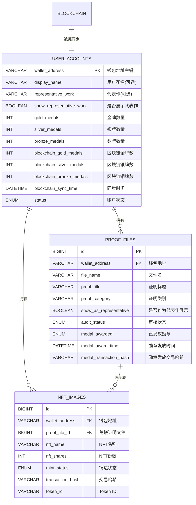

# 🏆 BrokerWallet DAPP 数据库架构设计

## 🎯 设计理念

基于**去中心化**和**隐私保护**的原则，最小化个人信息收集，以钱包地址为核心的DAPP数据库设计。

## 📊 表关系图



## 🔑 核心设计特点

### 1️⃣ 去中心化身份设计
```sql
-- 钱包地址作为主键，去除传统的自增ID
`wallet_address` VARCHAR(42) PRIMARY KEY COMMENT '钱包地址（以太坊地址，作为主键）'
```

**优势**：
- ✅ 真正的去中心化身份
- ✅ 跨平台身份一致性
- ✅ 无需传统注册流程
- ✅ 符合Web3理念

### 2️⃣ 隐私保护设计
```sql
-- 最小化个人信息，所有字段都是可选的
`display_name` VARCHAR(100) COMMENT '用户花名/显示名称（可选）'
`representative_work` VARCHAR(500) COMMENT '代表作描述（可选）'
-- 移除了邮箱、手机号、个人简介等敏感信息
```

**特点**：
- 🔒 无需真实身份信息
- 🔒 用户自主选择展示内容
- 🔒 支持完全匿名使用

### 3️⃣ 勋章系统核心设计
```sql
-- 金银铜三种勋章数量
`gold_medals` INT DEFAULT 0 COMMENT '金牌数量'
`silver_medals` INT DEFAULT 0 COMMENT '银牌数量'  
`bronze_medals` INT DEFAULT 0 COMMENT '铜牌数量'

-- 区块链数据同步字段
`blockchain_gold_medals` INT DEFAULT 0 COMMENT '区块链上的金牌数量'
`blockchain_silver_medals` INT DEFAULT 0 COMMENT '区块链上的银牌数量'
`blockchain_bronze_medals` INT DEFAULT 0 COMMENT '区块链上的铜牌数量'
`blockchain_sync_time` DATETIME COMMENT '最后一次与区块链同步时间'
```

**功能**：
- 🏆 完整的勋章管理系统
- 🔗 数据库与区块链双重存储
- ⚖️ 自动一致性检查机制
- 📊 支持排行榜功能

### 4️⃣ 证明文件审核流程
```sql
-- 审核状态管理
`audit_status` ENUM('PENDING', 'APPROVED', 'REJECTED', 'REVIEWING') NOT NULL DEFAULT 'PENDING'
`audit_time` DATETIME COMMENT '审核时间'
`audit_by` VARCHAR(100) COMMENT '审核人'
`audit_remarks` TEXT COMMENT '审核备注'

-- 勋章发放记录
`medal_awarded` ENUM('NONE', 'GOLD', 'SILVER', 'BRONZE') DEFAULT 'NONE'
`medal_award_time` DATETIME COMMENT '勋章发放时间'
`medal_transaction_hash` VARCHAR(66) COMMENT '勋章发放的区块链交易哈希'
```

**流程**：
1. 用户上传证明材料
2. 管理员审核证明
3. 审核通过后发放相应勋章
4. 同时更新数据库和区块链
5. 检查数据一致性

### 5️⃣ 代表作展示控制
```sql
-- 用户级别控制
`show_representative_work` BOOLEAN DEFAULT FALSE COMMENT '是否在排行榜展示代表作'

-- 证明文件级别控制  
`show_as_representative` BOOLEAN DEFAULT FALSE COMMENT '是否希望作为代表作在排行榜展示'
```

**特点**：
- 👤 用户完全自主控制
- 📱 手机端上传时可选择
- 🏆 排行榜智能展示

## 🎯 业务流程设计

### 📱 用户端流程


### 🖥️ 管理员端流程


## 🏆 排行榜算法设计

### 排序规则
```sql
-- 按照加权总分排序，然后按勋章数量细分排序
ORDER BY 
    ua.gold_medals * 3 + ua.silver_medals * 2 + ua.bronze_medals DESC,  -- 加权总分
    ua.gold_medals DESC,        -- 金牌数优先
    ua.silver_medals DESC,      -- 银牌数次之  
    ua.bronze_medals DESC       -- 铜牌数最后
```

### 展示内容
```sql
-- 排行榜显示逻辑
SELECT 
    COALESCE(ua.display_name, '匿名用户') as display_name,  -- 花名或匿名
    ua.gold_medals,
    ua.silver_medals, 
    ua.bronze_medals,
    CASE 
        WHEN ua.show_representative_work = TRUE AND ua.representative_work IS NOT NULL 
        THEN ua.representative_work 
        ELSE '不展示代表作' 
    END as representative_work  -- 根据用户设置展示代表作
```

## 🔗 区块链同步机制

### 数据一致性检查
```sql
-- 检查数据库与区块链数据是否一致
SELECT 
    ua.wallet_address,
    CASE 
        WHEN ua.gold_medals = ua.blockchain_gold_medals 
         AND ua.silver_medals = ua.blockchain_silver_medals 
         AND ua.bronze_medals = ua.blockchain_bronze_medals 
        THEN '✅ 一致' 
        ELSE '❌ 不一致，需要同步' 
    END as sync_status
FROM user_accounts ua;
```

### 同步策略
1. **以区块链为准**：当数据不一致时，以区块链数据为准
2. **定期同步**：定时任务检查和同步数据
3. **实时验证**：每次勋章发放后立即验证
4. **异常处理**：记录同步异常并报警

## 📊 核心查询示例

### 1️⃣ 获取排行榜
```sql
-- 获取前10名用户排行榜
SELECT 
    ROW_NUMBER() OVER (ORDER BY 
        ua.gold_medals * 3 + ua.silver_medals * 2 + ua.bronze_medals DESC
    ) as ranking,
    COALESCE(ua.display_name, CONCAT('用户', SUBSTRING(ua.wallet_address, 1, 8), '...')) as name,
    ua.gold_medals,
    ua.silver_medals,
    ua.bronze_medals,
    CASE 
        WHEN ua.show_representative_work = TRUE THEN ua.representative_work
        ELSE NULL
    END as representative_work
FROM user_accounts ua
WHERE ua.status = 'ACTIVE' 
  AND (ua.gold_medals > 0 OR ua.silver_medals > 0 OR ua.bronze_medals > 0)
ORDER BY ua.gold_medals * 3 + ua.silver_medals * 2 + ua.bronze_medals DESC
LIMIT 10;
```

### 2️⃣ 用户个人统计
```sql
-- 获取用户个人勋章统计
SELECT 
    ua.wallet_address,
    ua.display_name,
    ua.gold_medals,
    ua.silver_medals, 
    ua.bronze_medals,
    COUNT(DISTINCT pf.id) as total_proofs,
    COUNT(DISTINCT CASE WHEN pf.audit_status = 'APPROVED' THEN pf.id END) as approved_proofs,
    COUNT(DISTINCT ni.id) as total_nfts
FROM user_accounts ua
LEFT JOIN proof_files pf ON ua.wallet_address = pf.wallet_address AND pf.status = 'ACTIVE'
LEFT JOIN nft_images ni ON ua.wallet_address = ni.wallet_address AND ni.status = 'ACTIVE'
WHERE ua.wallet_address = ?
GROUP BY ua.wallet_address;
```

### 3️⃣ 管理员审核面板
```sql
-- 获取待审核的证明文件
SELECT 
    pf.id,
    pf.proof_title,
    pf.proof_category,
    pf.upload_time,
    COALESCE(ua.display_name, CONCAT('用户', SUBSTRING(ua.wallet_address, 1, 8), '...')) as user_name,
    pf.show_as_representative
FROM proof_files pf
JOIN user_accounts ua ON pf.wallet_address = ua.wallet_address
WHERE pf.audit_status = 'PENDING' 
  AND pf.status = 'ACTIVE'
ORDER BY pf.upload_time ASC;
```

## 🛡️ 安全性设计

### 数据完整性
- **外键约束**：确保数据关联的完整性
- **枚举限制**：限制状态字段的取值范围
- **非空约束**：关键字段不允许为空

### 隐私保护
- **最小化原则**：只收集必要的数据
- **用户控制**：用户完全控制信息展示
- **匿名支持**：支持完全匿名使用

### 区块链安全
- **双重验证**：数据库和区块链双重存储
- **一致性检查**：定期验证数据一致性
- **交易记录**：完整记录所有区块链交易

## 🚀 扩展性考虑

### 多链支持
- 预留`contract_address`字段支持多合约
- 可扩展支持多种区块链网络
- 钱包地址格式可适配不同链

### 功能扩展
- 可增加更多勋章类型
- 支持勋章等级细分
- 可添加团队/组织功能

### 性能优化
- 关键字段建立索引
- 支持分页查询
- 缓存热点数据

这个设计完美符合DAPP的去中心化理念，既保护了用户隐私，又提供了完整的勋章系统功能！
