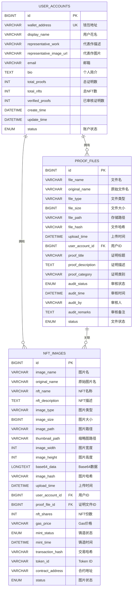
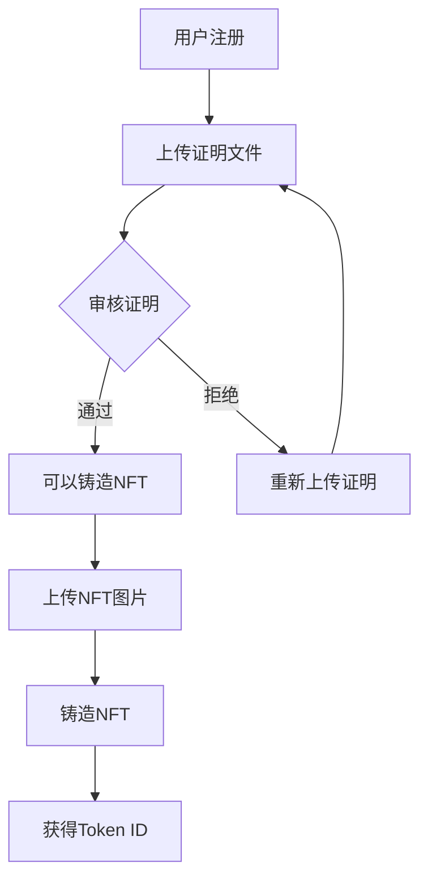

# 🗄️ BrokerWallet 数据库架构设计

## 📋 表关系图



## 🔗 表关系详解

### 1️⃣ 用户账户表 (user_accounts)
**作用**: 存储用户的基本信息和统计数据
- 🔑 **主键**: `id` - 自增长ID
- 🌟 **唯一键**: `wallet_address` - 以太坊钱包地址
- 📊 **统计字段**: 自动维护用户的证明数、NFT数等统计信息

```sql
-- 核心字段
wallet_address VARCHAR(42) NOT NULL UNIQUE    -- 0x开头的42位以太坊地址
display_name VARCHAR(100) NOT NULL            -- 用户花名，如"区块链开发者小王"
representative_work VARCHAR(500)              -- 代表作描述
representative_image_url VARCHAR(500)          -- 代表作图片链接
```

### 2️⃣ 证明文件表 (proof_files)
**作用**: 存储用户上传的证明材料及审核状态
- 🔗 **外键关联**: `user_account_id` → `user_accounts.id`
- ✅ **审核流程**: 支持完整的审核状态流转

```sql
-- 审核相关字段
audit_status ENUM('PENDING', 'APPROVED', 'REJECTED', 'REVIEWING')
audit_time DATETIME                           -- 审核时间
audit_by VARCHAR(100)                         -- 审核人
audit_remarks TEXT                            -- 审核备注

-- 证明分类字段
proof_category VARCHAR(50)                    -- 学历证明、工作证明、技能证明等
proof_title VARCHAR(200)                      -- 证明标题
proof_description TEXT                        -- 证明详细描述
```

### 3️⃣ NFT图片表 (nft_images)
**作用**: 存储NFT图片信息，强关联证明文件
- 🔗 **双重外键**:
  - `user_account_id` → `user_accounts.id`
  - `proof_file_id` → `proof_files.id` (**强关联**)

```sql
-- 强关联设计
proof_file_id BIGINT NOT NULL                 -- 必须关联证明文件
FOREIGN KEY (proof_file_id) REFERENCES proof_files(id) ON DELETE CASCADE

-- NFT铸造相关
nft_shares INT DEFAULT 1                      -- NFT份数
gas_price VARCHAR(50)                         -- Gas价格
mint_time DATETIME                            -- 铸造时间
transaction_hash VARCHAR(66)                  -- 区块链交易哈希
token_id VARCHAR(100)                         -- NFT Token ID
contract_address VARCHAR(42)                  -- NFT合约地址
```

## 🎯 业务逻辑设计

### 📋 业务流程


### 🔒 数据完整性约束

#### **外键约束**
```sql
-- 证明文件必须属于某个用户
FOREIGN KEY (user_account_id) REFERENCES user_accounts(id) ON DELETE CASCADE

-- NFT必须关联证明文件（强业务约束）
FOREIGN KEY (proof_file_id) REFERENCES proof_files(id) ON DELETE CASCADE
```

#### **业务规则约束**
1. **NFT铸造前提**: 必须有已审核通过的证明文件
2. **一对多关系**: 一个证明文件可以对应多个NFT
3. **用户唯一性**: 钱包地址全局唯一
4. **审核流程**: 证明文件必须经过审核才能用于NFT铸造

## 📊 索引优化设计

### 🚀 查询优化索引

```sql
-- 用户账户表索引
INDEX idx_wallet_address (wallet_address)     -- 钱包地址查询
INDEX idx_display_name (display_name)         -- 用户名搜索
INDEX idx_status (status)                     -- 状态筛选

-- 证明文件表索引
INDEX idx_user_account_id (user_account_id)   -- 用户证明查询
INDEX idx_audit_status (audit_status)         -- 审核状态筛选
INDEX idx_proof_category (proof_category)     -- 证明类别筛选
INDEX idx_upload_time (upload_time)           -- 时间排序

-- NFT图片表索引
INDEX idx_user_account_id (user_account_id)   -- 用户NFT查询
INDEX idx_proof_file_id (proof_file_id)       -- 证明关联查询
INDEX idx_mint_status (mint_status)           -- 铸造状态筛选
INDEX idx_transaction_hash (transaction_hash) -- 区块链交易查询
```

## 🔍 常用查询示例

### 1️⃣ 获取用户完整信息
```sql
SELECT 
    ua.display_name,
    ua.wallet_address,
    ua.representative_work,
    COUNT(DISTINCT pf.id) as total_proofs,
    COUNT(DISTINCT CASE WHEN pf.audit_status = 'APPROVED' THEN pf.id END) as approved_proofs,
    COUNT(DISTINCT ni.id) as total_nfts,
    COUNT(DISTINCT CASE WHEN ni.mint_status = 'SUCCESS' THEN ni.id END) as success_nfts
FROM user_accounts ua
LEFT JOIN proof_files pf ON ua.id = pf.user_account_id AND pf.status = 'ACTIVE'
LEFT JOIN nft_images ni ON ua.id = ni.user_account_id AND ni.status = 'ACTIVE'
WHERE ua.wallet_address = '0x1234567890123456789012345678901234567890'
GROUP BY ua.id;
```

### 2️⃣ 获取可铸造NFT的证明文件
```sql
SELECT pf.*, ua.display_name
FROM proof_files pf
JOIN user_accounts ua ON pf.user_account_id = ua.id
WHERE pf.audit_status = 'APPROVED' 
  AND pf.status = 'ACTIVE'
  AND ua.status = 'ACTIVE'
ORDER BY pf.upload_time DESC;
```

### 3️⃣ 获取NFT与证明文件的关联信息
```sql
SELECT 
    ni.nft_name,
    ni.mint_status,
    ni.transaction_hash,
    pf.proof_title,
    pf.proof_category,
    ua.display_name
FROM nft_images ni
JOIN proof_files pf ON ni.proof_file_id = pf.id
JOIN user_accounts ua ON ni.user_account_id = ua.id
WHERE ni.status = 'ACTIVE'
ORDER BY ni.upload_time DESC;
```

### 4️⃣ 审核统计报告
```sql
SELECT 
    pf.audit_status,
    COUNT(*) as count,
    COUNT(DISTINCT pf.user_account_id) as unique_users
FROM proof_files pf
WHERE pf.status = 'ACTIVE'
GROUP BY pf.audit_status;
```

## 🛠️ 数据库维护

### 📈 统计字段更新触发器
```sql
-- 自动更新用户统计信息的触发器（可选实现）
DELIMITER //
CREATE TRIGGER update_user_stats_after_proof_insert
AFTER INSERT ON proof_files
FOR EACH ROW
BEGIN
    UPDATE user_accounts 
    SET total_proofs = (
        SELECT COUNT(*) FROM proof_files 
        WHERE user_account_id = NEW.user_account_id AND status = 'ACTIVE'
    ),
    verified_proofs = (
        SELECT COUNT(*) FROM proof_files 
        WHERE user_account_id = NEW.user_account_id AND audit_status = 'APPROVED' AND status = 'ACTIVE'
    )
    WHERE id = NEW.user_account_id;
END//
DELIMITER ;
```

## 🚀 扩展性设计

### 📱 移动端适配
- 所有表支持分页查询
- 索引优化支持快速检索
- 支持按时间范围查询

### 🌐 区块链集成
- 预留完整的区块链字段
- 支持多链扩展（通过contract_address区分）
- 交易状态跟踪

### 🔐 安全性考虑
- 外键约束保证数据一致性
- 软删除设计保护数据
- 审核流程控制数据质量

这个数据库设计完美支持了您提出的业务需求：
- ✅ 用户账户、花名、代表作管理
- ✅ 证明文件审核流程
- ✅ NFT与证明文件的强关联
- ✅ 完整的业务流程支撑
